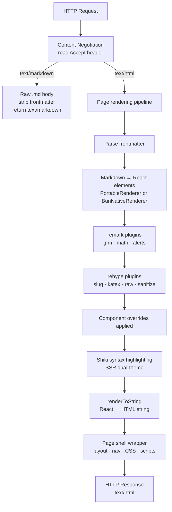

# Architecture

## Core design principle: portability

mkdnsite's handler is a standard Web API function:

```typescript
fetch(request: Request): Promise<Response>
```

That's it. No framework coupling, no environment assumptions. The same function runs on Bun's HTTP server, Cloudflare Workers, Vercel Edge, and anywhere else that speaks Web APIs.

Everything else is pluggable via interfaces.

## Key interfaces

### `ContentSource`

Where content comes from. The handler doesn't care about filesystems or APIs — it just calls `getPage(slug)`.

```typescript
interface ContentSource {
  getPage: (slug: string) => Promise<ContentPage | null>
  getNavTree: () => Promise<NavNode>
  listPages: () => Promise<ContentPage[]>
  refresh: () => Promise<void>
}
```

| Implementation | Status | Description |
|----------------|--------|-------------|
| `FilesystemSource` | ✅ Implemented | Local `.md` files (dev, self-hosted) |
| `GitHubSource` | ✅ Implemented | Public/private GitHub repos via API (with 5-min TTL caching) |
| `R2ContentSource` | ✅ Implemented | Cloudflare R2 bucket with optional KV caching |
| `AssetsSource` | ✅ Implemented | Cloudflare Workers Static Assets binding |
| `S3Source` | ⚠️ Planned | AWS S3 / compatible |

### `MarkdownRenderer`

How Markdown becomes React elements. Swap the rendering engine without touching the handler.

```typescript
interface MarkdownRenderer {
  readonly engine: RendererEngine
  renderToElement: (markdown: string, overrides?: ComponentOverrides) => ReactElement
  renderToHtml: (markdown: string, overrides?: ComponentOverrides) => string
}
```

`renderToElement` returns a React element tree for use with `renderToString()`. `renderToHtml` is a convenience method that combines both steps. Both are synchronous.

| Implementation | Status | Description |
|----------------|--------|-------------|
| `PortableRenderer` | ✅ Default | react-markdown + remark/rehype plugins. Works everywhere. |
| `BunNativeRenderer` | ✅ Bun only | `Bun.markdown.react()`. Faster, but **no full GFM support** (task list checkboxes stripped, other GFM features may differ). |

### `DeploymentAdapter`

Environment-specific wiring. Creates the content source, configures the renderer, and starts the server for a given environment.

```typescript
interface DeploymentAdapter {
  readonly name: string
  createContentSource: (config: MkdnSiteConfig) => ContentSource
  createRenderer: (config: MkdnSiteConfig) => Promise<MarkdownRenderer>
  start?: (
    handler: (request: Request) => Promise<Response>,
    config: MkdnSiteConfig
  ) => Promise<(() => void) | undefined>
}
```

`start` is optional — serverless adapters (Cloudflare, Vercel) omit it and export the handler directly. Local and Fly adapters implement it to bind a port.

| Implementation | Status | Description |
|----------------|--------|-------------|
| `LocalAdapter` | ✅ Implemented | Multi-runtime: Bun.serve / Deno.serve / node:http |
| `CloudflareAdapter` | ✅ Implemented | CF Workers with GitHub/R2/Assets sources, KV caching, Analytics Engine, R2 static files |
| `FlyAdapter` | ✅ Implemented | Fly.io with FilesystemSource on persistent volumes |
| `VercelAdapter` | ⚠️ Stub | Vercel Edge (planned) |
| `NetlifyAdapter` | ⚠️ Stub | Netlify Edge Functions (planned) |

### `ComponentOverrides`

Custom React components for any markdown element. Override headings, links, code blocks, images — anything.

```typescript
interface ComponentOverrides {
  h1?: ComponentType<HeadingProps>
  h2?: ComponentType<HeadingProps>
  p?: ComponentType<{ children?: ReactNode }>
  a?: ComponentType<LinkProps>
  pre?: ComponentType<CodeBlockProps>
  // ... all HTML elements
}
```

## Rendering pipeline



### Pipeline steps

1. **Content negotiation** — read `Accept` header, decide format
2. **Content fetch** — `ContentSource.getPage(slug)` → raw Markdown + metadata
3. **Frontmatter parse** — extract YAML metadata, separate body
4. **Markdown render** — body → React element tree via `MarkdownRenderer`
   - remark plugins: GFM, math, GitHub alerts
   - rehype plugins: heading slugs, KaTeX, raw HTML passthrough, XSS sanitization
5. **Component substitution** — apply `ComponentOverrides` at render time
6. **Syntax highlighting** — Shiki processes code blocks server-side, emitting CSS variable tokens
7. **`renderToString()`** — React tree → HTML string (no hydration)
8. **Page shell** — wrap in full HTML document with CSS, nav sidebar, theme scripts

## Content sources

### `FilesystemSource`

Reads `.md` files from a local directory tree. Maps file paths to URL slugs:

```
content/index.md          → /
content/about.md          → /about
content/docs/index.md     → /docs
content/docs/api.md       → /docs/api
```

Index file resolution order: `index.md` → `README.md` → `readme.md`

Nav tree is built recursively. Directory sections get their title and order from their `index.md` frontmatter. Empty directories (no `.md` files) are pruned from the nav automatically.

Caches pages in memory. Call `source.refresh()` to invalidate (done automatically in watch mode).

### `GitHubSource`

Reads `.md` files from a public or private GitHub repository. Uses `raw.githubusercontent.com` for file content (fast, no API rate limits for public repos) and the GitHub Git Trees API for file listing (one call, recursive).

```typescript
github: {
  owner: 'mkdnsite',
  repo: 'mkdnsite',
  ref: 'main',           // branch, tag, or commit SHA
  path: 'content',       // subdirectory within the repo (optional)
  token: process.env.GITHUB_TOKEN  // for private repos / higher rate limits
}
```

On first request, all `.md` files are fetched in parallel and cached for 5 minutes. Unauthenticated requests are limited to 60 API calls/hour; a token raises this to 5,000.

Respects `include` and `exclude` glob patterns for filtering files.

### `R2ContentSource`

Reads `.md` files from a Cloudflare R2 bucket. Used by the `CloudflareAdapter` when a `CONTENT_BUCKET` binding is present.

Supports optional KV-backed caching (`KVContentCache`) for faster reads across Worker isolates. Falls back to in-memory caching when no KV binding is available.

### `AssetsSource`

Reads `.md` files from Cloudflare Workers Static Assets (the `ASSETS` binding). This is the simplest Cloudflare deployment model — your content is bundled directly into the Worker as static assets.

Requires either a `CONTENT_MANIFEST` env var (JSON array of `.md` file paths) or a `_manifest.json` in the assets for file discovery.

### Shared nav tree builder

All content sources use a shared `buildNavTree()` function from `nav-builder.ts` to construct the navigation tree from parsed file entries. This ensures consistent nav behavior regardless of where content is stored.

## Key design decisions

**No `.tsx` files** — Node's native TypeScript type-stripping doesn't handle `.tsx`. All React code uses `React.createElement()` instead of JSX syntax. This keeps the codebase compatible with all three runtimes without a build step.

**`remark-gfm` over `Bun.markdown`** — `Bun.markdown.react()` does not fully support GitHub-Flavored Markdown. Task list checkboxes are stripped, and other GFM features may behave differently. The portable renderer (react-markdown + remark-gfm) is the default because it handles all GFM features correctly. Choose `bun-native` only when you need the speed gain and don't depend on full GFM rendering.

**Shiki dual themes via CSS variables** — uses `defaultColor: false` with `--shiki-light`/`--shiki-dark` CSS variables. Switching color scheme doesn't require re-rendering HTML — the CSS handles it at zero cost.

**`data-theme` on `<html>`** — a blocking script in `<head>` sets `data-theme="light|dark"` before paint. No FOUC, no layout shift. Falls back to `@media (prefers-color-scheme)` for no-JS environments.

**`rehype-raw` + `rehype-sanitize`** — raw HTML in Markdown is allowed (for `<details>`, `<summary>`, custom HTML), but XSS vectors are blocked (`<script>`, `<iframe>`, event handlers). Safe elements like SVG and KaTeX output are whitelisted explicitly.

## Key files

```
src/
  index.ts                  Public API exports
  cli.ts                    CLI entry point (Bun/Node/Deno compatible)
  handler.ts                Core fetch handler — the important file
  version.ts                Package version constant
  config/
    schema.ts               All TypeScript types and interfaces
    defaults.ts             Default config values + resolveConfig()
  content/
    types.ts                ContentSource, ContentPage, NavNode, GitHubSourceConfig
    frontmatter.ts          YAML frontmatter parser
    filesystem.ts           FilesystemSource (local dev)
    github.ts               GitHubSource (GitHub API + raw.githubusercontent.com)
    r2.ts                   R2ContentSource (Cloudflare R2 bucket)
    assets.ts               AssetsSource (Cloudflare Workers Static Assets)
    cache.ts                ContentCache interface + KVContentCache + MemoryContentCache
    nav-builder.ts          Shared nav tree builder (used by all content sources)
  render/
    types.ts                MarkdownRenderer interface + factory
    portable.ts             react-markdown renderer (default)
    bun-native.ts           Bun.markdown.react() renderer
    components/index.ts     Default React components (headings, links, code)
    page-shell.ts           Full HTML page wrapper (SSR)
  negotiate/
    accept.ts               Accept header parsing + format selection
    headers.ts              Response headers + token estimation
  discovery/
    llmstxt.ts              /llms.txt auto-generation
  theme/
    base-css.ts             Built-in CSS theme (BASE_THEME_CSS)
    build-css.ts            buildThemeCss() — assembles final CSS
  client/
    scripts.ts              Client-side JS (theme toggle, copy, mermaid, search, charts)
  search/
    index.ts                TF-IDF search index (server-side)
  mcp/
    server.ts               MCP HTTP server (Streamable HTTP transport)
    stdio.ts                MCP stdio transport (mkdnsite mcp subcommand)
    transport.ts            Shared MCP transport helpers
  analytics/
    types.ts                TrafficAnalytics interface + TrafficEvent
    classify.ts             Request classification (human/ai_agent/bot/mcp)
    console.ts              ConsoleAnalytics (JSON lines to stdout)
    noop.ts                 NoopAnalytics (disabled placeholder)
  cache/
    response.ts             ResponseCache interface + CachedResponse type
    kv.ts                   KVResponseCache (Cloudflare KV-backed)
    memory.ts               MemoryResponseCache (in-memory with TTL)
  security/
    csp.ts                  Content Security Policy header builder
  adapters/
    types.ts                DeploymentAdapter interface + runtime detection
    local.ts                Multi-runtime local adapter
    cloudflare.ts           Cloudflare Workers adapter (GitHub/R2/Assets, analytics, caching)
    vercel.ts               Vercel Edge adapter (stub)
    netlify.ts              Netlify adapter (stub)
    fly.ts                  Fly.io adapter (FilesystemSource on persistent volumes)
```

## Extending mkdnsite

### Custom content source

```typescript
import type { ContentSource, ContentPage, NavNode } from 'mkdnsite'

class MySource implements ContentSource {
  async getPage(slug: string): Promise<ContentPage | null> {
    // fetch from your API, database, CMS, etc.
  }

  async getNavTree(): Promise<NavNode> {
    // build navigation tree
  }

  async listPages(): Promise<ContentPage[]> {
    // return all pages for llms.txt, sitemaps, etc.
  }

  async refresh(): Promise<void> {
    // invalidate caches
  }
}
```

Then pass it to `createHandler`:

```typescript
import { createHandler, createRenderer, resolveConfig } from 'mkdnsite'

const config = resolveConfig({ site: { title: 'My Site' } })
const source = new MySource()

// createRenderer takes a RendererEngine string or RendererOptions object
const renderer = await createRenderer({
  engine: 'portable',
  syntaxTheme: 'github-light',
  syntaxThemeDark: 'github-dark',
  math: true
})

const handler = createHandler({ source, renderer, config })
```

### Custom React components

```typescript
import { createHandler, buildComponents } from 'mkdnsite'
import type { HeadingProps, LinkProps } from 'mkdnsite'

const components = buildComponents({
  h1: ({ children, id }) =>
    React.createElement('h1', { id, className: 'my-heading' }, children),

  a: ({ href, children }) =>
    React.createElement('a', { href, className: 'my-link', target: '_blank' }, children)
})
```
