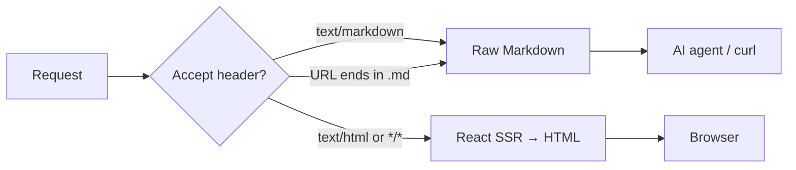

# Content Negotiation

mkdnsite uses standard HTTP content negotiation to serve different formats from the same URL. Browsers get rendered HTML. AI agents get clean Markdown. No special endpoints, no separate routes — just the `Accept` header.

## The philosophy

Markdown is the source of truth. Always. mkdnsite never converts HTML back to Markdown (that's someone else's problem). Your `.md` files are the canonical content, and we render them appropriately for whoever is asking.

This is the inverse of tools like Cloudflare's "Markdown for AI" that scrape HTML and convert it. We start from Markdown and go forward.

## How it works

```
Request → read Accept header → decide format → return response
```



## Format selection

| Condition | Format |
|-----------|--------|
| `Accept: text/markdown` | Raw Markdown (no frontmatter) |
| `Accept: text/markdown, text/html` | Raw Markdown (markdown wins) |
| `Accept: text/html` | Rendered HTML |
| `Accept: */*` | Rendered HTML |
| No `Accept` header | Rendered HTML |
| URL ends in `.md` | Raw Markdown (overrides Accept) |

> **Note:** When both `text/markdown` and `text/html` appear in the Accept header, Markdown wins. This matches how Claude Code and other AI agents typically send their headers.

## curl examples

```bash
# Browser request — gets HTML
curl http://localhost:3000

# AI agent — gets raw Markdown
curl -H "Accept: text/markdown" http://localhost:3000

# Claude Code style header — gets Markdown
curl -H "Accept: text/markdown, text/html, */*" http://localhost:3000

# Force Markdown via URL suffix (any client)
curl http://localhost:3000/docs/getting-started.md

# List all content for AI discovery
curl http://localhost:3000/llms.txt
```

## Markdown response

When serving Markdown, mkdnsite returns the raw body of the `.md` file with frontmatter stripped. The response is clean Markdown with no HTML wrapper, no navigation, no headers — just the content.

```bash
$ curl -H "Accept: text/markdown" http://localhost:3000/docs/getting-started

# Getting Started

## Install
...
```

## Response headers

### HTML responses

```
Content-Type: text/html; charset=utf-8
Vary: Accept
```

### Markdown responses

```
Content-Type: text/markdown; charset=utf-8
Vary: Accept
x-markdown-tokens: 847
Content-Signal: ai-train=yes, search=yes, ai-input=yes
```

The `Vary: Accept` header tells caches that the response varies by the Accept header, ensuring browsers and AI agents don't serve each other's cached responses.

### `x-markdown-tokens`

An estimated token count for the Markdown content. Useful for AI agents managing context windows. Cloudflare-compatible header.

```bash
$ curl -sI -H "Accept: text/markdown" http://localhost:3000/docs/getting-started
x-markdown-tokens: 423
```

Disable with `negotiation.includeTokenCount: false`.

### `Content-Signal`

Signals to AI systems about how this content may be used:

| Signal | Default | Description |
|--------|---------|-------------|
| `ai-train` | `yes` | Allow use for AI training datasets |
| `search` | `yes` | Allow search engine indexing |
| `ai-input` | `yes` | Allow use as context/input to AI systems |

Configure in `mkdnsite.config.ts`:

```typescript
negotiation: {
  contentSignals: {
    aiTrain: 'no',    // opt out of training
    search: 'yes',
    aiInput: 'yes'
  }
}
```

## `/llms.txt`

mkdnsite auto-generates a `/llms.txt` file — a standard format for helping AI agents discover and navigate your content.

```bash
curl http://localhost:3000/llms.txt
```

Example output:

```
# My Project Docs

> Documentation for my project.

## Docs

- [Getting Started](https://docs.example.com/docs/getting-started): Install and run in under a minute
- [Configuration](https://docs.example.com/docs/configuration): Full mkdnsite.config.ts reference
- [CLI Reference](https://docs.example.com/docs/cli): All flags and usage patterns
```

The format follows the [llms-txt specification](https://llmstxt.org/). Each page appears as a link with its description from frontmatter.

Customize in config:

```typescript
llmsTxt: {
  enabled: true,
  description: 'Documentation for my project.',
  sections: {
    'docs': 'API Reference',     // /docs/* pages → "## API Reference"
    'guides': 'Tutorials'        // /guides/* pages → "## Tutorials"
  }
}
```

Keys are the first path segment of each page's URL (i.e. the top-level directory name). Values are the section heading used in `/llms.txt`. Without this override, section headings are derived from the directory name via title-case (e.g. `'docs'` → `'Docs'`).

Disable with `--no-llms-txt` or `llmsTxt.enabled: false`.

## Disabling content negotiation

For sites where you want to keep Markdown private:

```typescript
negotiation: {
  enabled: false
}
```

Or via CLI: `mkdnsite --no-negotiate --no-llms-txt`

When disabled, all requests receive HTML regardless of the `Accept` header. URL `.md` suffixes also stop working.

## Quality weights

mkdnsite respects quality weight parameters in the Accept header:

```
Accept: text/html;q=0.9, text/markdown;q=0.8
```

In this case, `text/html` has higher priority, so HTML is served. The matching algorithm follows RFC 7231.

## What AI agents see

AI agents that support content negotiation get a clean reading experience:

- No navigation markup
- No page chrome (header, footer, theme toggle)
- No script tags
- Frontmatter stripped (just the body)
- Pure, portable Markdown

This makes mkdnsite-hosted documentation ideal as context for AI systems — the content is pre-formatted for consumption.
