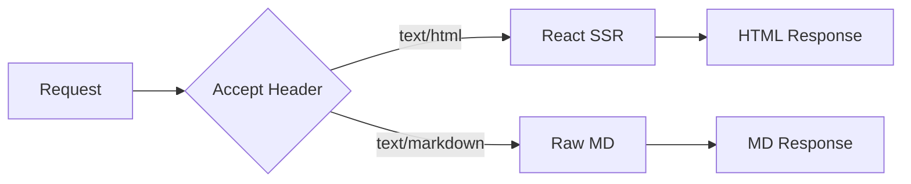

# Heading 1

## Heading 2

### Heading 3

#### Heading 4

##### Heading 5

###### Heading 6

## Paragraphs

This is a paragraph of text. Markdown is the source of truth in mkdnsite — browsers see rendered HTML, AI agents see raw Markdown. The same URL serves both formats via content negotiation.

This is a second paragraph. It has **bold text**, *italic text*, ***bold and italic text***, and ~~strikethrough text~~. You can also write `inline code` within a paragraph.

## Links

- [Internal link to Getting Started](/docs/getting-started)
- [External link to GitHub](https://github.com/mkdnsite/mkdnsite)
- Autolinked URL: https://mkdn.site

## Images


## Blockquotes

> This is a blockquote. It can contain **formatted text** and [links](https://mkdn.site).

> Blockquotes can also
> span multiple lines
> like this.

> Nested blockquotes:
>
> > This is a nested blockquote.
> > It goes one level deeper.

## Unordered Lists

- First item
- Second item
  - Nested item A
  - Nested item B
    - Deeply nested item
- Third item

## Ordered Lists

1. First step
2. Second step
   1. Sub-step one
   2. Sub-step two
3. Third step

Ordered list with a custom start:

5. Fifth item
6. Sixth item
7. Seventh item

## Task Lists (GFM)

- [x] Set up the project
- [x] Add content negotiation
- [ ] Improve default styling
- [ ] Add client-side search

## Code Blocks

Inline code: use the `createHandler()` function to create a fetch handler.

### JavaScript

```javascript
import { createHandler, resolveConfig } from 'mkdnsite'
import { LocalAdapter } from 'mkdnsite/adapters/local'

const config = resolveConfig({
  site: { title: 'My Docs' },
  theme: { mode: 'prose' }
})

const adapter = new LocalAdapter()
const source = adapter.createContentSource(config)
const renderer = await adapter.createRenderer(config)
const handler = createHandler({ source, renderer, config })
```

### TypeScript

```typescript
interface ContentSource {
  getPage: (slug: string) => Promise<ContentPage | null>
  getNavTree: () => Promise<NavNode>
  listPages: () => Promise<ContentPage[]>
  refresh: () => Promise<void>
}
```

### Bash

```bash
# Install mkdnsite globally
bun add -g mkdnsite

# Start a dev server with watch mode
mkdnsite ./content --port 8080

# Fetch as markdown
curl -H "Accept: text/markdown" http://localhost:8080
```

### HTML

```html
<!DOCTYPE html>
<html lang="en">
<head>
  <meta charset="utf-8">
  <title>Example</title>
</head>
<body>
  <h1>Hello, world!</h1>
</body>
</html>
```

### JSON

```json
{
  "name": "mkdnsite",
  "version": "0.0.1",
  "dependencies": {
    "react": "^19.0.0",
    "react-markdown": "^9.0.0"
  }
}
```

### Plain (no language)

```
This is a plain code block with no language specified.
It should still be rendered in a monospace font.
```

## Tables (GFM)

| Feature | Bun | Node | Deno |
| ------- | --- | ---- | ---- |
| Runtime rendering | Yes | Yes | Yes |
| Content negotiation | Yes | Yes | Yes |
| Bun.markdown (fast path) | Yes | No | No |
| Native `.ts` support | Yes | Yes | Yes |

Table with alignment:

| Left-aligned | Center-aligned | Right-aligned |
|:-------------|:--------------:|--------------:|
| Content | Content | Content |
| More | More | More |
| Data | Data | Data |

## Horizontal Rules

Content above the rule.

---

Content below the rule.

***

Another rule style.

## Alerts (GFM)

> [!NOTE]
> Useful information that users should know, even when skimming content.

> [!TIP]
> Helpful advice for doing things better or more easily.

> [!IMPORTANT]
> Key information users need to know to achieve their goal.

> [!WARNING]
> Urgent info that needs immediate user attention to avoid problems.

> [!CAUTION]
> Advises about risks or negative outcomes of certain actions.

## Collapsible Sections

<details>
<summary>Click to expand</summary>

This content is hidden by default. It can contain **markdown formatting**, `inline code`, and other elements.

- Item one
- Item two
- Item three

</details>

<details>
<summary>Another collapsible with a code block</summary>

```typescript
const config = resolveConfig({
  site: { title: 'Hidden Config' }
})
```

</details>

<details open>
<summary>This section is open by default</summary>

Use the `open` attribute on the `<details>` element to have it expanded initially.

</details>

## Blockquote with Multiple Elements

> ### Blockquote heading
>
> This blockquote contains a heading, a paragraph, and a list:
>
> - Item one
> - Item two
>
> And some `inline code` too.

## Mermaid Diagrams



## Math Expressions

Inline math: The quadratic formula is $x = \frac{-b \pm \sqrt{b^2 - 4ac}}{2a}$ and Euler's identity is $e^{i\pi} + 1 = 0$.

Display math (block):

$$
\int_{-\infty}^{\infty} e^{-x^2} \, dx = \sqrt{\pi}
$$

A summation:

$$
\sum_{n=1}^{\infty} \frac{1}{n^2} = \frac{\pi^2}{6}
$$

Maxwell's equations in differential form:

$$
\nabla \cdot \mathbf{E} = \frac{\rho}{\varepsilon_0}, \quad \nabla \times \mathbf{B} = \mu_0 \mathbf{J} + \mu_0 \varepsilon_0 \frac{\partial \mathbf{E}}{\partial t}
$$

## Emphasis and Inline Formatting

This paragraph exercises all inline formatting: **bold**, *italic*, ***bold italic***, ~~strikethrough~~, `inline code`, and [a link](#emphasis-and-inline-formatting).

## Deeply Nested Lists

1. First level
   - Second level unordered
     1. Third level ordered
        - Fourth level unordered
   - Another second level
2. Back to first level

## Long Code Block

```typescript
/**
 * Create a portable fetch handler for mkdnsite.
 *
 * This handler conforms to the Web API fetch(request): Response
 * pattern, making it compatible with Bun, Node, Deno, and edge runtimes.
 */
export function createHandler (opts: HandlerOptions): (request: Request) => Promise<Response> {
  const { source, renderer, config } = opts

  return async function handler (request: Request): Promise<Response> {
    const url = new URL(request.url)
    const pathname = decodeURIComponent(url.pathname)

    // Content negotiation
    const format = negotiateFormat(request.headers.get('Accept'))

    if (format === 'markdown') {
      const page = await source.getPage(pathname)
      if (page == null) {
        return new Response('# 404\n\nPage not found.\n', {
          status: 404,
          headers: { 'Content-Type': 'text/markdown; charset=utf-8' }
        })
      }
      return new Response(page.body, {
        status: 200,
        headers: markdownHeaders(estimateTokens(page.body), config.negotiation.contentSignals)
      })
    }

    // ... HTML rendering via React SSR
  }
}
```
