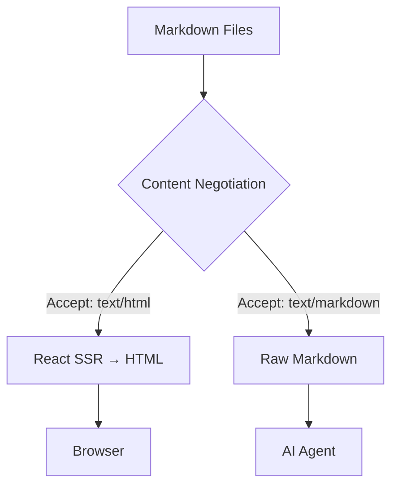

# Getting Started

## Install

```bash
bun add -g mkdnsite
```

## Quick Start

```
my-site/
├── index.md          → /
├── about.md          → /about
└── docs/
    ├── index.md      → /docs
    └── api.md        → /docs/api
```

```bash
mkdnsite ./my-site
```

Visit `http://localhost:3000`.

## Content Negotiation

```bash
curl http://localhost:3000                              # HTML
curl -H "Accept: text/markdown" http://localhost:3000   # Markdown
curl http://localhost:3000/docs/getting-started.md       # Markdown via .md
curl http://localhost:3000/llms.txt                      # AI content index
```

## Mermaid Diagrams

Fenced code blocks with `mermaid` language are rendered as diagrams:


