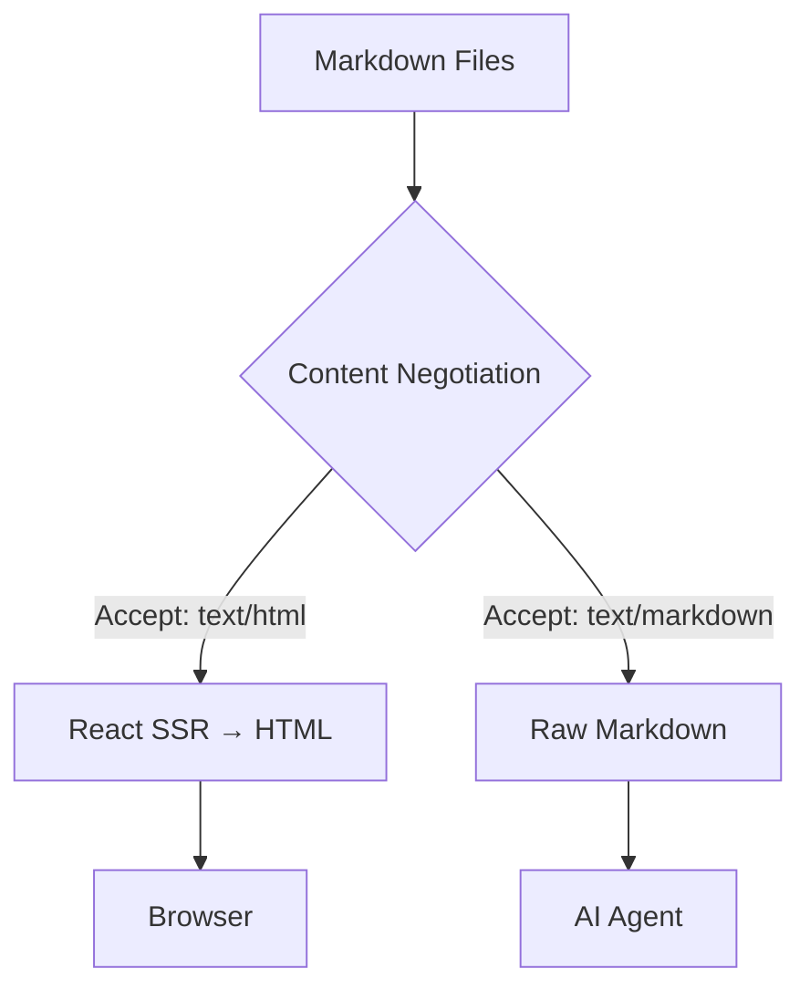

# Getting Started

## Install

```bash
bun add -g mkdnsite
```

Also works with Node 22+ and Deno 2.

## Quick start

Create a directory of Markdown files:

```
my-site/
├── index.md          → /
├── about.md          → /about
└── docs/
    ├── index.md      → /docs
    └── api.md        → /docs/api
```

Start the server:

```bash
mkdnsite ./my-site
```

Visit `http://localhost:3000`. Your Markdown is live, with nav sidebar, dark mode, and syntax highlighting — zero configuration needed.

## Content negotiation

mkdnsite serves different formats from the same URL based on the `Accept` header:

```bash
curl http://localhost:3000                              # HTML (browser)
curl -H "Accept: text/markdown" http://localhost:3000   # Markdown (AI agent)
curl http://localhost:3000/docs/getting-started.md       # Markdown via .md suffix
curl http://localhost:3000/llms.txt                      # AI content index
```

See [Content Negotiation](/docs/content-negotiation) for details.

## Configuration

Create `mkdnsite.config.ts` for persistent settings:

```typescript
import type { MkdnSiteConfig } from 'mkdnsite'

const config: Partial<MkdnSiteConfig> = {
  site: {
    title: 'My Docs',
    description: 'Documentation for my project.'
  },
  theme: {
    colors: { accent: '#7c3aed' },
    colorsDark: { accent: '#a78bfa' }
  }
}

export default config
```

See [Configuration](/docs/configuration) for the full reference, or [CLI Reference](/docs/cli) for all command-line flags.

## Mermaid diagrams

Fenced code blocks with the `mermaid` language tag are rendered as diagrams:



## Custom theming

Quick accent color override:

```bash
mkdnsite ./content --accent "#e11d48"
```

For full control — custom colors, fonts, logo, and external stylesheets — see [Theming](/docs/theming).

## Next steps

| | |
|---|---|
| [Configuration](/docs/configuration) | All config options explained |
| [CLI Reference](/docs/cli) | Every flag with examples |
| [Content Negotiation](/docs/content-negotiation) | How HTTP negotiation works |
| [Theming](/docs/theming) | Colors, fonts, logos, CSS overrides |
| [Frontmatter](/docs/frontmatter) | Page metadata reference |
| [Architecture](/docs/architecture) | Design and extension points |
| [Search](/docs/search) | Built-in ⌘K search modal |
| [MCP Server](/docs/mcp) | AI agent access via MCP |
| [Charts](/docs/charts) | Chart.js charts from Markdown |
| [Docker](/docs/docker) | Run in a container |
| [Element Examples](/docs/elements) | Visual showcase of all Markdown elements |
